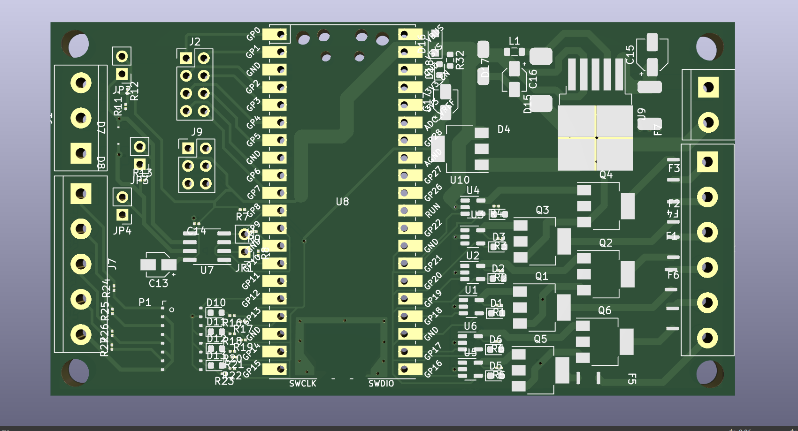

# piaa
PIAA, inspired by the [CIAA project](https://github.com/ciaa/Hardware).


The PIAA is a open source [printed cicuit board](https://en.wikipedia.org/wiki/Printed_circuit_board) design for use in industrial settings where [electromagnetic interference](https://en.wikipedia.org/wiki/Electromagnetic_interference) is of great concern. The on board processor is intended to be the RP2040 contained in the [Raspberry Pi Pico](https://www.raspberrypi.com/products/raspberry-pi-pico/) package

Features:
- All I/O except for GPIO header come with extensive EMI protection.
- Wide temperature range components.
- 1 RS485 peripheral using MAX3072E.
- 6 Digital outputs with PWM capabilities.
- 4 digital inputs.
- Powered be 6-24V input.
- 8 additional GPIO on header with SPI, I2C, UART, PWM, PIO capabilities. This header is connected to GPIO0 through GPIO7.
- Regulated 3.3V and 5V outputs.



# Project setup
I'd believe the project should be set automatically since I've taken care to include all libraries as "Project" libraries, not "Global". 
In any case, if that fails you may follow the steps detailed here to setup any symbol, footprint and 3D model libraries that may be needed
to work or visualize the PIAA.

1. Initialize git submodules with external symbol and footprint libraries such as the Raspberry pi pico's footprint:

    ```sh
    git submodule update --init
    ```

    Now follow the symbol installation instructions at [this link](https://github.com/ncarandini/KiCad-RP-Pico/blob/main/Install%20instructions.md)
    and use the footprint in the folder [RP-Pico Libraries](./submodules/KiCad-RP-Pico/RP-Pico Libraries).

2. Setup `piaalib` symbol and footprint libraries. They are located under [design/lib/piaalib](./design/lib/piaalib).
The steps to adding these libraries are the same as with the RP-Pico libraries.
